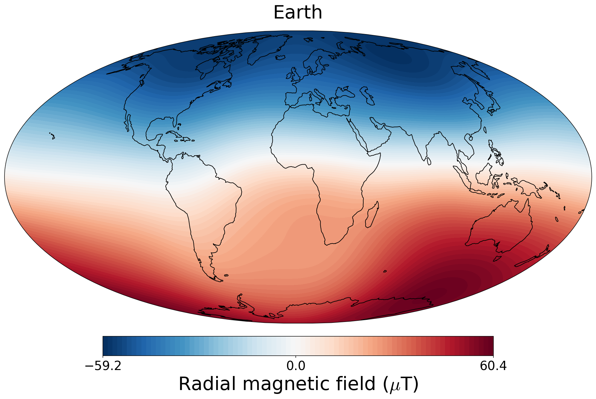
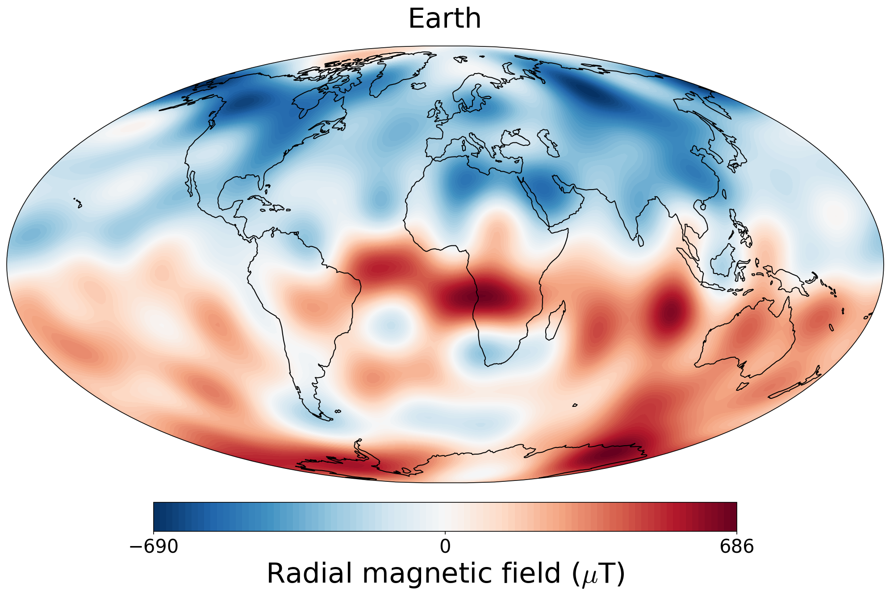

# planetMagFields

Routines to visualize magnetic fields of planets in our solar system, in both 2D and 3D.
Makes use of the [SHTns](https://bitbucket.org/nschaeff/shtns), [cartopy](https://scitools.org.uk/cartopy/docs/latest/) and [PyEVTK](https://github.com/paulo-herrera/PyEVTK) libraries.

# The `planet` class

This gives access to all the relevant properties of a planet and has methods to plot
the field and write a `vts` file for 3D visualization. Usage:

```python
from planetMagFields import *
p = planet(name='earth',datDir='planetMagFields/data/')
```

This displays the some information about the planet

```
Planet: Earth
Depth (fraction of surface radius) = 1.00
l_max = 13
Dipole tilt (degrees) = -9.410531
```

and gives access to
variables associated with the planet such as:

 - `p.lmax` : maximum spherical harmonic degree till which data is available
 - `p.Br` : computed radial magnetic field at surface
 - `p.dipTheta` : dipole tilt with respect to the rotation axis
 - `p.dipPhi` : dipole longitude ( in case zero longitude is known, applicable to Earth )

as well as the functions:

 - `p.plot()` which will plot a 2D surface plot of the field, and
 - `p.writeVtsFile` which will write a vts file that can be used to produce 3D visualizations of field lines with Paraview/VisIt. Usage:

```python
p.writeVtsFile(potExtra=False, ratio_out=2, nrout=32)
```
where,

  - `potExtra` : bool, whether to use potential extrapolation
  - `ratio_out`: float, radius till which the field would be extrapolated in terms of the surface radius
  - `nrout`: radial resolution for extrapolation

## Quickplot using the `magField` script:

```
$ ./magField <planet> <radius>
```

This will plot the radial magnetic field of a planet (any of the names from the list
below, case insensitive) at a radius given in terms of the surface radius. The default
is the surface field. For example,

```
$ ./magField earth
```

displays some information about Earth's field and produces the surface field of Earth 

```
Radius not specified, using surface

Planet: Earth
Depth (fraction of surface radius) = 1.00
l_max = 13
Dipole tilt (degrees) = -9.410531
```



while

```
$ ./magField earth 0.55
```

produces the field at the core-mantle boundary (CMB)

```
Planet: Earth
Depth (fraction of surface radius) = 0.55
l_max = 13
Dipole tilt (degrees) = -9.410531
```



```
$ ./magField all <radius>
```

would produce a plot of all magnetic field maps of different planets in a single figure
along with a table of information about dipole tilt for each.


# Data sources

Mercury : [Anderson et. al. 2012](https://doi.org/10.1029/2012JE004159)

Earth   : [IGRF 13](https://www.ngdc.noaa.gov/IAGA/vmod/igrf.html)

Jupiter : [JRM09, Connerny et. al. 2018](https://doi.org/10.1002/2018GL077312)

Saturn  : [Cassini 11+, Cao et. al. 2020](https://doi.org/10.1016/j.icarus.2019.113541)

Uranus  : [Connerny et. al. 1987](https://doi.org/10.1029/JA092iA13p15329)

Neptune : [Connerny et. al. 1991](https://doi.org/10.1029/91JA01165)

Ganymede: [Kivelson et. al. 2002](https://doi.org/10.1006/icar.2002.6834)
