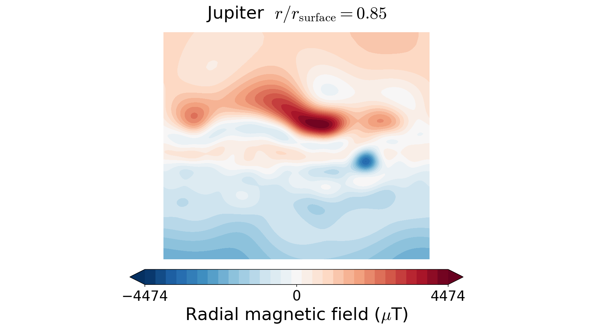
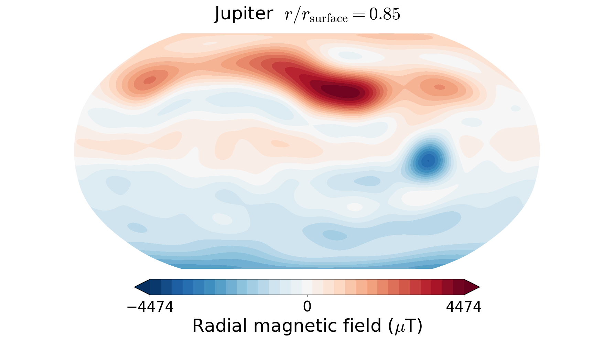

# planetMagFields
[](https://www.gnu.org/licenses/gpl-3.0)

Routines to easily access information about magnetic fields of planets in our solar system and visualize them in both 2D and 3D. These require [NumPy](https://numpy.org/), [Matplotlib](https://matplotlib.org/) and [SciPy](https://www.scipy.org/) (pronounced "Sigh Pie"). Other than that, the following external libraries are used for a few different functions:

 - 2D plotting for map projections other than Hammer : [Cartopy](https://scitools.org.uk/cartopy/docs/latest/) library ( see more under [Projections](#projections) )
 - Potential extrapolation: [SHTns](https://bitbucket.org/nschaeff/shtns) library
 - Writing vts files for 3D visualisation: [PyEVTK](https://github.com/paulo-herrera/PyEVTK) library

# The `planet` class

This gives access to all the relevant properties of a planet and has methods to plot
the field and write a `vts` file for 3D visualization. Usage:

```python
from planetmagfields import *
p = planet(name='earth',datDir='planetmagfields/data/')
```

This displays the some information about the planet

```
Planet: Earth
l_max = 13
Dipole tilt (degrees) = -9.410531
```

and gives access to
variables associated with the planet such as:

 - `p.lmax` : maximum spherical harmonic degree till which data is available
 - `p.glm`, `p.hlm`: the Gauss coefficients
 - `p.Br` : computed radial magnetic field at surface
 - `p.dipTheta` : dipole tilt with respect to the rotation axis
 - `p.dipPhi` : dipole longitude ( in case zero longitude is known, applicable to Earth )

as well as the functions:

## `planet.plot()`

This function plots a 2D surface plot of the radial magnetic field at radius `r` given in terms of the surface radius.
For example,

```python
from planetmagfields import *
p = planet(name='earth',datDir='planetmagfields/data/')
p.plot(r=1,proj='Mollweide')
```

produces the info mentioned above first and then the following plot of Earth's magnetic field using a Mollweide projection


while

```python
from planetmagfields import *
p = planet(name='jupiter',datDir='planetmagfields/data/')
p.plot(r=0.85,proj='Mollweide')
```
produces the following info about Jupiter and then plot that follows

```
Planet: Jupiter
l_max = 10
Dipole tilt (degrees) = 10.307870
```


This can be compared with Fig. 1 g from [Moore et al. 2018](https://doi.org/10.1038/s41586-018-0468-5)

## `planet.spec()`

This function computes the Lowes spectrum of a planet at a given radius. It adds an array `p.emag_spec` which contains the energy at different spherical harmonic degrees and two variables `p.dipolarity` and `p.dip_tot` which provide the fraction of energies in the axial dipole and the total dipole with respect to the total energy at all degrees. Usage example:

```python
from planetmagfields import *
p = planet(name='jupiter')
p.spec()
```

will provide variables

```python
In [8]: p.dipolarity
Out[8]: 0.7472047129875864

In [9]: p.dip_tot
Out[9]: 0.7719205112704368

In [10]: p.emag_spec
Out[10]:
array([0.00000000e+00, 3.47735422e+11, 2.36340423e+10, 2.12851278e+10,
       1.75661779e+10, 1.92219842e+10, 9.91200756e+09, 3.34535475e+09,
       3.95317971e+09, 2.59333412e+09, 1.23423769e+09])
```

and will produce Jupiter's surface spectrum:


The plotting can be suppressed setting the logical `p.spec(iplot=False)`.

## `planet.writeVtsFile()`

This function writes a vts file that can be used to produce 3D visualizations of field lines with Paraview/VisIt. Usage:

```python
p.writeVtsFile(potExtra=True, ratio_out=2, nrout=32)
```
where,

  - `potExtra` : bool, whether to use potential extrapolation
  - `ratio_out`: float, radius till which the field would be extrapolated in terms of the surface radius
  - `nrout`: radial resolution for extrapolation

Example of a 3D image produced using Paraview for Neptune's field, extrapolated till 5 times the surface radius.


# Field filtering using `planet.plot_filt`

The `planet` class also provides a function for producing a filtered view of the radial magnetic field using the function `plot_filt`.
This function can take in either an arbitrary array of spherical harmonic degrees and orders or cut-off values. This is illustrated
below with examples, assuming the user is in the repository directory.

## Saturn's small-scale magnetic field at a depth of 0.75 planetary radius ( degree > 3 )

```python
from planetmagfields import *
p = planet(name='saturn')
p.plot_filt(r=0.75,lCutMin=4,proj='Mollweide')
```


Compare this with Fig. 20 B from [Cao et al. 2020](https://doi.org/10.1016/j.icarus.2019.113541)

## Jupiter's surface field restricted to degrees 1,2,3 and order 3

```python
from planetmagfields import *
p = planet(name='jupiter')
p.plot_filt(r=1,larr=[1,2,3],marr=[3],proj='Mollweide')
```


## Earth's smaller scale surface field for degree > 4 and order > 3

```python
from planetmagfields import *
p = planet(name='earth')
p.plot_filt(r=1,lCutMin=5,mmin=4,proj='Mollweide')
```


# Potential extrapolation

The `potextra` module provides a method for potential extrapolation of a planet's magnetic field.
This uses the [SHTns](https://bitbucket.org/nschaeff/shtns) library for spherical harmonic transforms.
Usage example:

```python
import numpy as np
from planetmagfields import *
p = planet('saturn')
ratio_out = 5 # Ratio (> 1) in terms of surface radius to which to extrapolate
nrout = 32 # Number of grid points in radius between 1 and ratio_out
rout = np.linspace(1,ratio_out,nrout)
brout, btout, bpout = potextra.extrapot(p.lmax,1.,p.Br,rout)
```

# Quickplot using the `magField.py` script:

```
$ ./magField.py <planet> <radius> <projection>
```

This will plot the radial magnetic field of a planet (any of the names from the list
below, case insensitive) at a radius given in terms of the surface radius. The default
is the surface field. For example,

```
$ ./magField.py earth Mollweide
```

displays the same information as above about Earth's field and produces the surface field of Earth while

```
$ ./magField.py jupiter 0.85 Mollweide
```

produces the same plot of Jupiter's field as shown before.

```
$ ./magField.py all <radius> <projection>
```

would produce a table of information about dipole tilt for each planet and magnetic field maps of all different planets at the given radius in a single figure.

For example:

```
$ ./magField all 0.9 Mollweide
```

would give

```
|=========|======|=======|
|Planet   | Theta| Phi   |
|=========|======|=======|
|Mercury  | 0.0  | 0.0   |
|Earth    | -9.4 | -72.7 |
|Jupiter  | 10.3 | -16.6 |
|Saturn   | 0.0  | 0.0   |
|Uranus   | 58.6 | -53.6 |
|Neptune  | 46.9 | -72.0 |
|Ganymede | -4.2 | 25.5  |
|---------|------|-------|
```

followed by the following plot


# Spherical harmonic normalization and Condon-Shortley phase

All the Gauss coefficients in the collected data are Schmidt semi-normalized.
Only the data for Earth uses a Condon-Shortley phase, the others do not.

# Projections

By default, the plot function tries to use the Mollweide projection. However, using the power of the [cartopy](https://scitools.org.uk/cartopy/docs/latest/) library, any projection from [this list](https://scitools.org.uk/cartopy/docs/latest/crs/projections.html) is supported. In the absence of the cartopy library, the 2D plots fall back to the internally written Hammer projection. Examples of Jupiter's radial magnetic field at r=0.85 with different projections are shown below:

```python
In [1]: from planetmagfields import *

In [2]: p = planet(name='jupiter')
Planet: Jupiter
l_max = 10
Dipole tilt (degrees) = 10.307870

In [3]: p.plot(r=0.85)

In [4]: projlist=['Mercator','Robinson','Stereographic','AzimuthalEquidistant']

In [5]: for k,proj in enumerate(projlist):
   ...:     p.plot(r=0.85,proj=proj)
   ...:     savefig('jup_r0_85'+proj+'.png',dpi=150,bbox_inches='tight')
   ...:     close()
```

`In[3]` produces the plot of Jupiter's field already shown above. `In[5]` produces the following figures with the Mercator, Robinson, Stereographic and azimuthal equidistant projections, respectively.

  

  

This also works with the `magField.py` script for quick plotting. Examples:

```bash
./magField.py earth 0.9 Robinson
```

or even with plots of all planets together

```bash
./magField.py all 0.9 Robinson
```

Note that I have chosen to keep the projection information out of the plot titles to prevent too much text.

❗ | The Orthographic projection often does not create correct plots, be cautious while using it 
:---: | :---

# Data sources

Mercury : [Anderson et al. 2012](https://doi.org/10.1029/2012JE004159)

Earth   : [IGRF 13](https://www.ngdc.noaa.gov/IAGA/vmod/igrf.html)

Jupiter : [JRM09, Connerney et al. 2018](https://doi.org/10.1002/2018GL077312)

Saturn  : [Cassini 11+, Cao et al. 2020](https://doi.org/10.1016/j.icarus.2019.113541)

Uranus  : [Connerny et al. 1987](https://doi.org/10.1029/JA092iA13p15329)

Neptune : [Connerny et al. 1991](https://doi.org/10.1029/91JA01165)

Ganymede: [Kivelson et al. 2002](https://doi.org/10.1006/icar.2002.6834)
