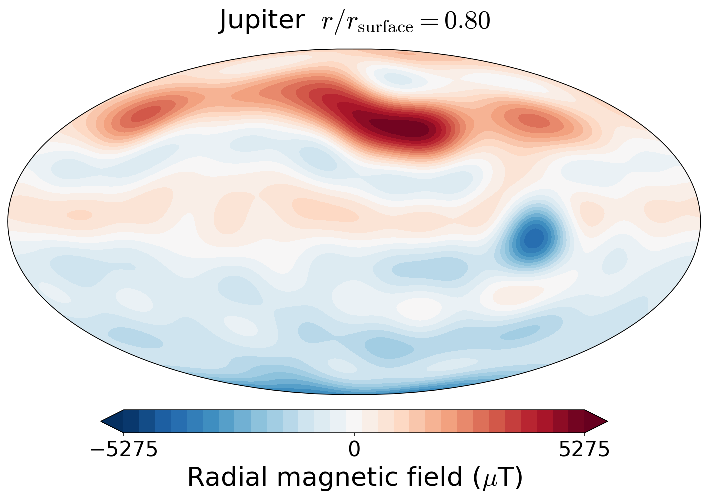
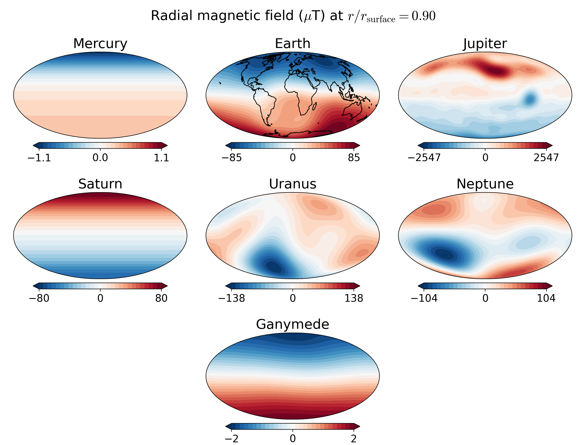

# planetMagFields
[](https://www.gnu.org/licenses/gpl-3.0)

Routines to visualize magnetic fields of planets in our solar system, in both 2D and 3D.
Makes use of the [SHTns](https://bitbucket.org/nschaeff/shtns), [cartopy](https://scitools.org.uk/cartopy/docs/latest/) and [PyEVTK](https://github.com/paulo-herrera/PyEVTK) libraries.

# The `planet` class

This gives access to all the relevant properties of a planet and has methods to plot
the field and write a `vts` file for 3D visualization. Usage:

```python
from planetMagFields import *
p = planet(name='earth',datDir='planetMagFields/data/')
```

This displays the some information about the planet

```
Planet: Earth
Depth (fraction of surface radius) = 1.00
l_max = 13
Dipole tilt (degrees) = -9.410531
```

and gives access to
variables associated with the planet such as:

 - `p.lmax` : maximum spherical harmonic degree till which data is available
 - `p.glm`, `p.hlm`: the Gauss coefficients
 - `p.Br` : computed radial magnetic field at surface
 - `p.dipTheta` : dipole tilt with respect to the rotation axis
 - `p.dipPhi` : dipole longitude ( in case zero longitude is known, applicable to Earth )

as well as the functions:

## `planet.plot(r=1)`

This function plots a 2D surface plot of the radial magnetic field at radius `r` given in terms of the surface radius.
For example,

```python
from planetMagFields import *
p = planet(name='earth',datDir='planetMagFields/data/')
p.plot(r=1)
```

produces the info mentioned above first and then the following plot of Earth's magnetic field


while

```python
from planetMagFields import *
p = planet(name='jupiter',datDir='planetMagFields/data/')
p.plot(r=0.8)
```
produces the following info about Jupiter and then plot that follows

```
Planet: Jupiter
Depth (fraction of surface radius) = 1.00
l_max = 10
Dipole tilt (degrees) = 10.307870
```



## `planet.writeVtsFile`

This function writes a vts file that can be used to produce 3D visualizations of field lines with Paraview/VisIt. Usage:

```python
p.writeVtsFile(potExtra=True, ratio_out=2, nrout=32)
```
where,

  - `potExtra` : bool, whether to use potential extrapolation
  - `ratio_out`: float, radius till which the field would be extrapolated in terms of the surface radius
  - `nrout`: radial resolution for extrapolation

Example of a 3D image produced using Paraview for Neptune's field, extrapolated till 5 times the surface radius.


# Potential extrapolation

The `potextra` module provides a method for potential extrapolation of a planet's magnetic field.
This uses the [SHTns](https://bitbucket.org/nschaeff/shtns) library for spherical harmonic transforms.
Usage example:

```python
import numpy as np
from planetMagFields import *
p = planet('saturn')
ratio_out = 5 # Ratio (> 1) in terms of surface radius to which to extrapolate
nrout = 32 # Number of grid points in radius between 1 and ratio_out
rout = np.linspace(1,ratio_out,nrout)
brout, btout, bpout = potextra.extrapot(p.lmax,1.,p.Br,rout)
```

# Quickplot using the `magField` script:

```
$ ./magField <planet> <radius>
```

This will plot the radial magnetic field of a planet (any of the names from the list
below, case insensitive) at a radius given in terms of the surface radius. The default
is the surface field. For example,

```
$ ./magField earth
```

displays the same information as above about Earth's field and produces the surface field of Earth while

```
$ ./magField jupiter 0.8
```

produces the same plot of Jupiter's field as shown before.

```
$ ./magField all <radius>
```

would produce a table of information about dipole tilt for each planet and magnetic field maps of all different planets at the given radius in a single figure.

For example: 

```
$ ./magField all 0.9
```

would give

```
|=========|======|=======|
|Planet   | Theta| Phi   |
|=========|======|=======|
|Mercury  | 0.0  | 0.0   |
|Earth    | -9.4 | -72.7 |
|Jupiter  | 10.3 | -16.6 |
|Saturn   | 0.0  | 0.0   |
|Uranus   | 58.6 | -53.6 |
|Neptune  | 46.9 | -72.0 |
|Ganymede | -4.2 | 25.5  |
|---------|------|-------|
```

followed by the following plot



# Spherical harmonic normalization and Condon-Shortley phase

All the Gauss coefficients in the collected data are Schmidt semi-normalized.
Only the data for Earth uses a Condon-Shortley phase, the others do not.

# Data sources

Mercury : [Anderson et al. 2012](https://doi.org/10.1029/2012JE004159)

Earth   : [IGRF 13](https://www.ngdc.noaa.gov/IAGA/vmod/igrf.html)

Jupiter : [JRM09, Connerny et al. 2018](https://doi.org/10.1002/2018GL077312)

Saturn  : [Cassini 11+, Cao et al. 2020](https://doi.org/10.1016/j.icarus.2019.113541)

Uranus  : [Connerny et al. 1987](https://doi.org/10.1029/JA092iA13p15329)

Neptune : [Connerny et al. 1991](https://doi.org/10.1029/91JA01165)

Ganymede: [Kivelson et al. 2002](https://doi.org/10.1006/icar.2002.6834)
