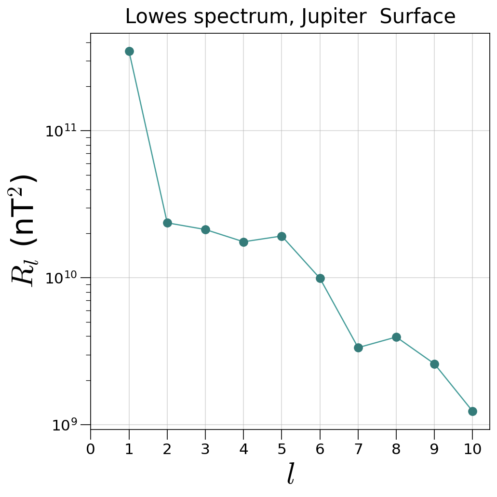
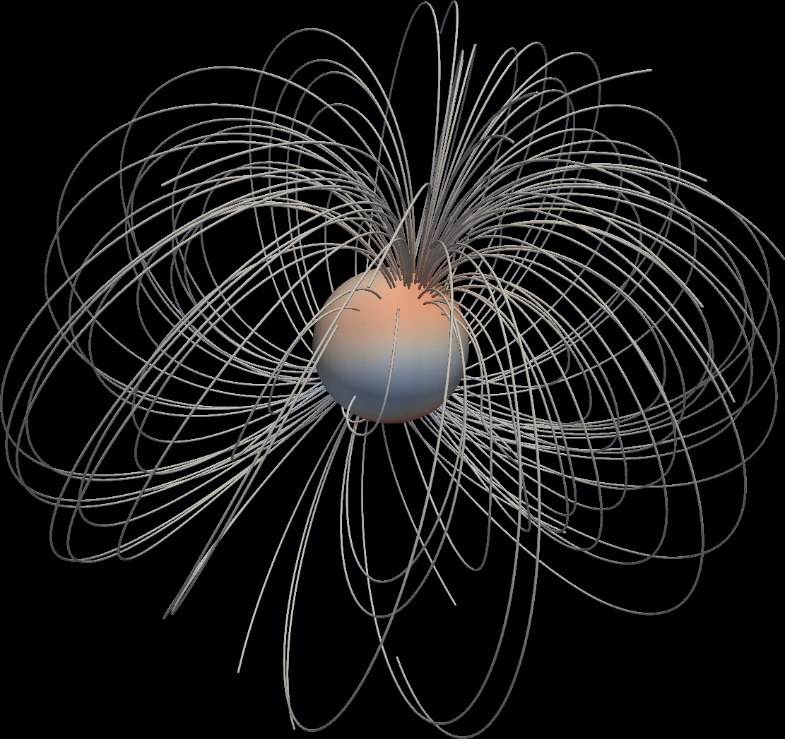
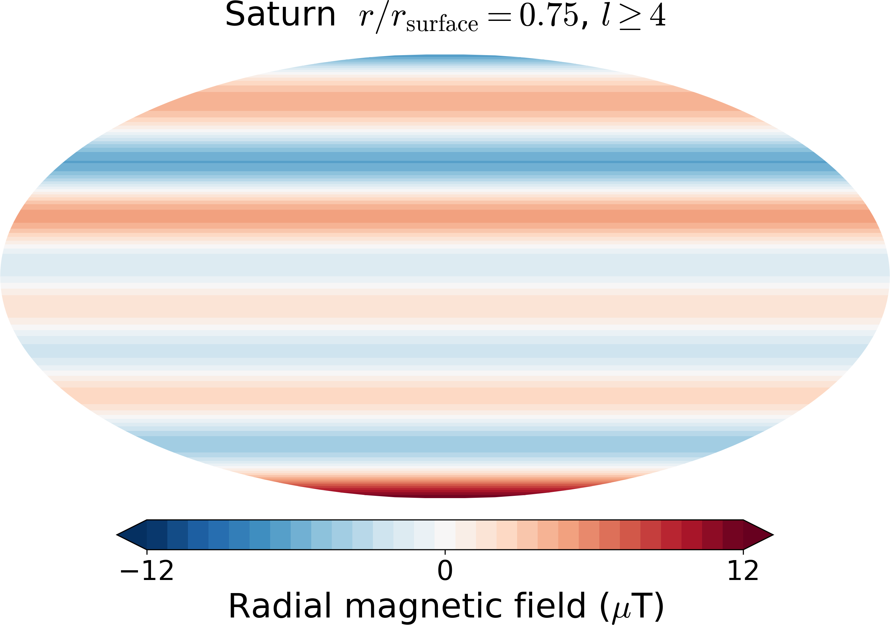
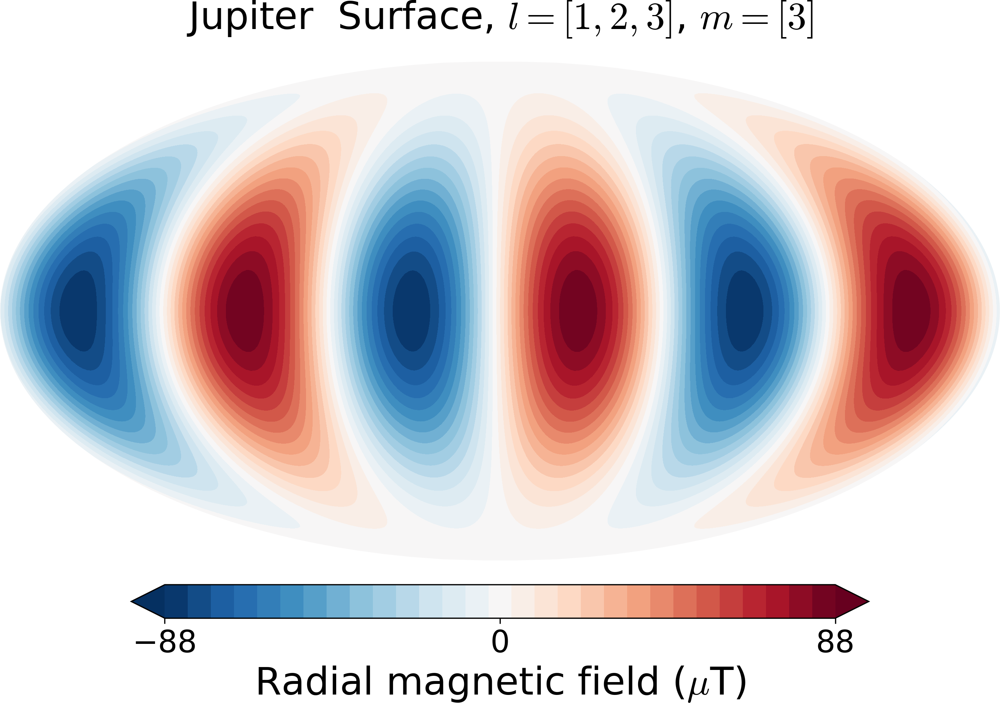
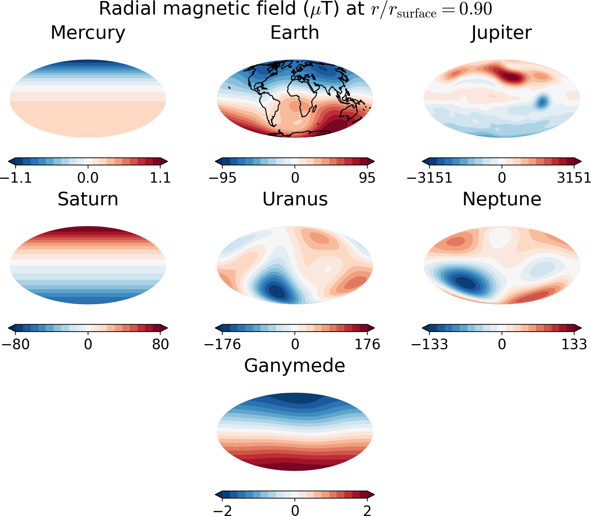

.. planetMagFields documentation master file, created by
   sphinx-quickstart on Mon Jan 22 08:32:05 2024.
   You can adapt this file completely to your liking, but it should at least
   contain the root `toctree` directive.

.. _secExamples:

#########################
Features and examples
#########################

The :py:class:`Planet <planetmagfields.Planet>` class
*****************************************************

This gives access to all the relevant properties of a planet and has methods to plot
the field and write a `vts` file for 3D visualization. Usage:

.. code-block:: python

   from planetmagfields import Planet
   p = Planet(name='earth')

This displays the some information about the planet

.. code-block:: bash

   Planet: Earth
   l_max = 13
   Dipole tilt (degrees) = -9.410531

and gives access to variables associated with the planet such as:

  * ``p.lmax`` : maximum spherical harmonic degree till which data is available
  * ``p.glm``, ``p.hlm``: the Gauss coefficients
  * ``p.Br`` : computed radial magnetic field at surface
  * ``p.dipTheta`` : dipole tilt with respect to the rotation axis
  * ``p.dipPhi`` : dipole longitude ( in case zero longitude is known, applicable to Earth )
  * ``p.idx`` : indices to get values of Gauss coefficients
  * ``p.model`` : the :ref:`magnetic field model <secmodels>` used. Available models can be obtained using the :py:func:`get_models <planetmagfields.get_models>` function. Selects the latest available model when unspecified.
  * ``p.unit`` : The unit for outputs for magnetic field components and plots, by default microTeslas. Can be nanoTeslas, microTeslas and Gauss and can be specified using specific strings 'muT', 'nuT' or 'Gauss' (case independent) while calling the :py:class:`planetmagfields.Planet` class. More details in :ref:`Units<secunits>`.

Example using ``IPython``:

.. code-block:: python

   In [1]: from planetmagfields import Planet

   In [2]: p = Planet(name='jupiter',model='jrm09')
   Planet: Jupiter
   Model: jrm09
   l_max = 10
   Dipole tilt (degrees) = 10.307870

   In [3]: p.glm[p.idx[2,0]]      # g20 in nT
   Out[3]: 11670.4

   In [4]: p.hlm[p.idx[4,2]]      # h42 in nT
   Out[4]: 27811.2

as well as the functions:

:py:func:`Planet.plot() <planetmagfields.Planet.plot>`
^^^^^^^^^^^^^^^^^^^^^^^^^^^^^^^^^^^^^^^^^^^^^^^^^^^^^^

This function plots a 2D surface plot of the radial magnetic field at radius `r` given in terms of the surface radius.
For example,

.. code-block:: python

   from planetmagfields import Planet
   p = Planet(name='earth')
   p.plot(r=1,proj='Mollweide')

produces the info mentioned above first and then the following plot of Earth's magnetic field using a Mollweide projection

.. image:: _static/images/2d/earth2d.png
   :width: 400
   :align: center

while

.. code-block:: python

   from planetmagfields import Planet
   p = Planet(name='jupiter',model='jrm09')
   p.plot(r=0.85,proj='Mollweide')

produces the following info about Jupiter and then plot that follows

.. code-block:: console

   Planet: Jupiter
   l_max = 10
   Dipole tilt (degrees) = 10.307870

.. image:: _static/images/jupiter_r085.png
   :width: 400
   :align: center

This can be compared with Fig. 1 g from `Moore et al. 2018 <https://doi.org/10.1038/s41586-018-0468-5>`_ .

.. _secSpec:

:py:func:`Planet.spec() <planetmagfields.Planet.spec>`
^^^^^^^^^^^^^^^^^^^^^^^^^^^^^^^^^^^^^^^^^^^^^^^^^^^^^^

This function computes the Lowes spectrum of a planet at a given radius. It adds an array ``p.emag_spec`` which contains the energy at different spherical harmonic degrees and two variables ``p.dipolarity`` and ``p.dip_tot`` which provide the fraction of energies in the axial dipole and the total dipole with respect to the total energy at all degrees. In addition, it provides equatorially symmetric and antisymmetric as well as axisymmetric contributions to the Lowes energy spectrum. Usage example:

.. code-block:: python

   from planetmagfields import Planet
   p = Planet(name='jupiter',model='jrm33')
   p.spec()

will provide variables

.. code-block:: python

   In [22]: p.dipolarity
   Out[22]: 0.747204704567949

   In [23]: p.dip_tot
   Out[23]: 0.7719205020945153

   In [24]: p.emag_spec
   Out[24]:
   array([0.00000000e+00, 3.47735401e+11, 2.36340427e+10, 2.12851283e+10,
         1.75661770e+10, 1.92219833e+10, 9.91200748e+09, 3.34535482e+09,
         3.95317968e+09, 2.59333418e+09, 1.23423771e+09])

   In [25]: p.emag_symm/p.emag_tot # Symmetric part
   Out[25]: 0.16062699807374292

   In [26]: p.emag_antisymm/p.emag_tot # Anti-symmetric part
   Out[26]: 0.8393730019262573

   In [27]: p.emag_axi/p.emag_tot # Axisymmetric part
   Out[27]: 0.7768733455808511

and will produce Jupiter's surface spectrum:

The plotting can be suppressed setting the logical `p.spec(iplot=False)`. A different radius other than surface can be selected using the `p.spec(r=0.8)` parameter. API documentation : :py:func:`Planet.spec() <planetmagfields.Planet.spec>`

.. _secVts:

:py:func:`Planet.writeVtsFile() <planetmagfields.Planet.writeVtsFile>`
^^^^^^^^^^^^^^^^^^^^^^^^^^^^^^^^^^^^^^^^^^^^^^^^^^^^^^^^^^^^^^^^^^^^^^

This function writes a vts file that can be used to produce 3D visualizations of field lines with Paraview/VisIt. Usage:

.. code-block:: python

   p.writeVtsFile(potExtra=True, ratio_out=2, nrout=32)

where,

  - ``potExtra`` : bool, whether to use potential extrapolation. This uses the `SHTns <https://bitbucket.org/nschaeff/shtns>`_ library for spherical harmonic transforms.
  - ``ratio_out``: float, radius till which the field would be extrapolated in terms of the surface radius
  - ``nrout``: radial resolution for extrapolation

Example of a 3D image produced using `Paraview <https://www.paraview.org/>`_ for Neptune's field, extrapolated till 5 times the surface radius is given below.

Field filtering using :py:func:`Planet.plot_filt <planetmagfields.Planet.plot_filt>`
************************************************************************************

The ``planet`` class also provides a function for producing a filtered view of the radial magnetic field using the function ``plot_filt``.
This function can take in either an arbitrary array of spherical harmonic degrees and orders or cut-off values. This is illustrated
below with examples, assuming the user is in the repository directory.

Saturn's small-scale magnetic field
^^^^^^^^^^^^^^^^^^^^^^^^^^^^^^^^^^^^

Here we plot Saturn's magnetic field at a depth of 0.75 planetary radius for spherical harmonic degrees > 3.

.. code-block:: python

   from planetmagfields import Planet
   p = Planet(name='saturn')
   p.plot_filt(r=0.75,lCutMin=4,proj='Mollweide')

Compare this with Fig. 20 B from `Cao et al. 2020 <https://doi.org/10.1016/j.icarus.2019.113541>`_ .

Jupiter's surface field
^^^^^^^^^^^^^^^^^^^^^^^
Here we filter out Jupiter's surface field restricted to degrees 1,2,3 and order 3.

.. code-block:: python

   from planetmagfields import Planet
   p = Planet(name='jupiter',model='jrm09')
   p.plot_filt(r=1,larr=[1,2,3],marr=[3],proj='Mollweide')

Earth's smaller scale surface field
^^^^^^^^^^^^^^^^^^^^^^^^^^^^^^^^^^^
We filter the surface field to degrees > 4 and orders > 3.

.. code-block:: python

   from planetmagfields import Planet
   p = Planet(name='earth')
   p.plot_filt(r=1,lCutMin=5,mmin=4,proj='Mollweide')

.. image:: _static/images/earth_lgeq5mgeq4_2d.png
   :width: 400
   :align: center

.. _subsecPotExtra:

Potential extrapolation
************************

.. warning::

   Potential extrapolation prior to v1.5.1 had a bug and the extrapolated fields would be overestimated. Please take care!

The :py:func:`Planet.extrapolate <planetmagfields.Planet.extrapolate>` performs a potential extrapolation of a planet's magnetic field. The functions are present in the ``potextra`` module. This uses the `SHTns <https://bitbucket.org/nschaeff/shtns>`_ library for spherical harmonic transforms.
Usage example:

.. code-block:: python

   import numpy as np
   from planetmagfields import Planet
   p = Planet('saturn')
   ratio_out = 5 # Ratio (> 1) in terms of surface radius to which to extrapolate
   nrout = 32 # Number of grid points in radius between 1 and ratio_out
   rout = np.linspace(1,ratio_out,nrout)
   p.extrapolate(rout) #Gives you three arrays p.br_ex, p.btheta_ex, p.bphi_ex

.. _subsecOrbit:

Get field along a trajectory
*****************************

.. warning::

   Potential extrapolation prior to v1.5.1 had a bug and the extrapolated fields would be overestimated. Please take care!

You can obtain field components along a trajectory (for example, obtained from NASA's `SPICE Toolkit <https://naif.jpl.nasa.gov/naif/toolkit.html>`_) using the function :py:func:`Planet.orbit_path <planetmagfields.Planet.orbit_path>`. This also uses the `SHTns <https://bitbucket.org/nschaeff/shtns>`_ library for spherical harmonic transforms. Usage example below using some points from the Cassini Grand Finale:

.. code-block:: python

   from planetmagfields import Planet
   p = Planet('saturn')

   r = [17.82905598, 17.82110528, 17.81314499, 17.80517584, 17.79719656] # Can also be numpy array
   theta = [1.1865416 , 1.18632847, 1.18611515, 1.18590167, 1.18568798]
   phi = [4.70867942, 4.70884014, 4.70900102, 4.70916207, 4.7093233 ]

   p.orbit_path(r,theta,phi)
   print(p.br_orb)
   print(p.btheta_orb)
   print(p.bphi_orb)

This will provide the outputs:

.. code-block:: console

    Planet: Saturn
    Model: cassini11+
    l_max = 14
    Dipole tilt (degrees) = 0.000000
    [0.00278097 0.00278617 0.00279139 0.00279662 0.00280187]
    [0.00347406 0.00347843 0.00348281 0.00348721 0.00349161]
    [0. 0. 0. 0. 0.]

.. _secMagFieldScript:

Quickplot using the ``magField.py`` script
********************************************

.. code-block:: console

   $ ./magField.py --help
   usage: magField.py [-h] [-p PLANET] [-r R] [-c CMAP] [-l LEVELS] [-m PROJ] [-o MODEL]

   Script for easy plotting of planetary magnetic field.

   optional arguments:
   -h, --help            show this help message and exit
   -p PLANET, --planet PLANET
                           Planet name (default : earth)
   -r R, --radius R      Radial level scaled to planetary radius (default : 1)
   -c CMAP, --cmap CMAP  Colormap of plot (default : RdBu_r)
   -l LEVELS, --levels LEVELS
                           Number of contour levels (default : 20)
   -m PROJ, --mapproj PROJ
                           Type of map projection (default : Mollweide)
   -o MODEL, --model MODEL
                           Model to be used, uses the latest model by default (default : None)

This will plot the radial magnetic field of a planet (any of the names from the list
below, case insensitive) at a radius given in terms of the surface radius with a given
map projection. The default is the surface field. More details are available through
the help.

For example,

.. code-block:: bash

   $ ./magField.py -p earth -m Mollweide

displays the same information as above about Earth's field and produces the surface field of Earth while

.. code-block:: bash

   $ ./magField.py -p jupiter -r 0.85 -m Mollweide -o jrm09

produces the same plot of Jupiter's field as shown before.

.. code-block:: bash

   $ ./magField.py -p all -r <radius> -m <projection>

would produce a table of information about dipole tilt for each planet and magnetic field maps of all different planets at the given radius in a single figure.

For example:

.. code-block:: bash

   $ ./magField.py -p all -r 0.9 -m Mollweide

would give

.. code-block:: console

   |=========|======|=======|
   |Planet   | Theta| Phi   |
   |=========|======|=======|
   |Mercury  | 0.0  | 0.0   |
   |Earth    | -9.4 | -72.7 |
   |Jupiter  | 10.3 | -16.6 |
   |Saturn   | 0.0  | 0.0   |
   |Uranus   | 58.6 | -53.6 |
   |Neptune  | 46.9 | -72.0 |
   |Ganymede | -4.2 | 25.5  |
   |---------|------|-------|

followed by the following plot

