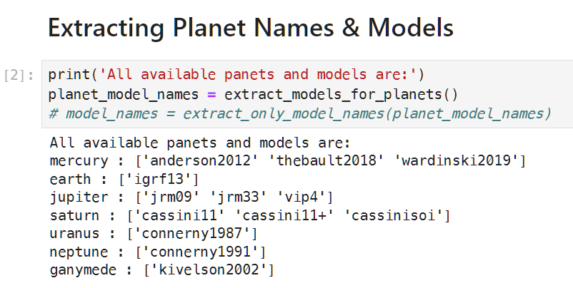
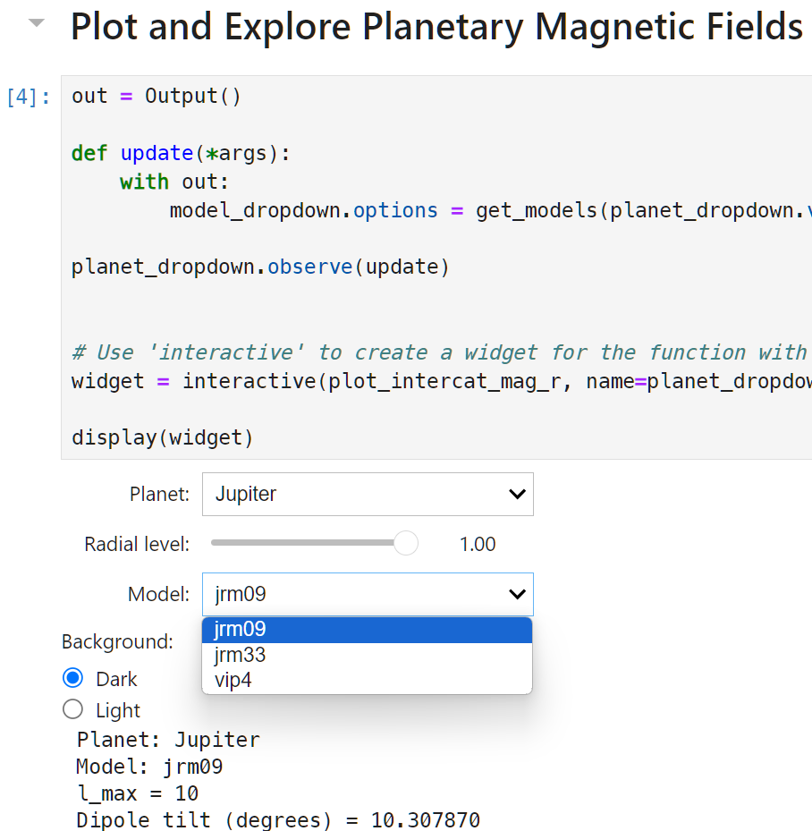
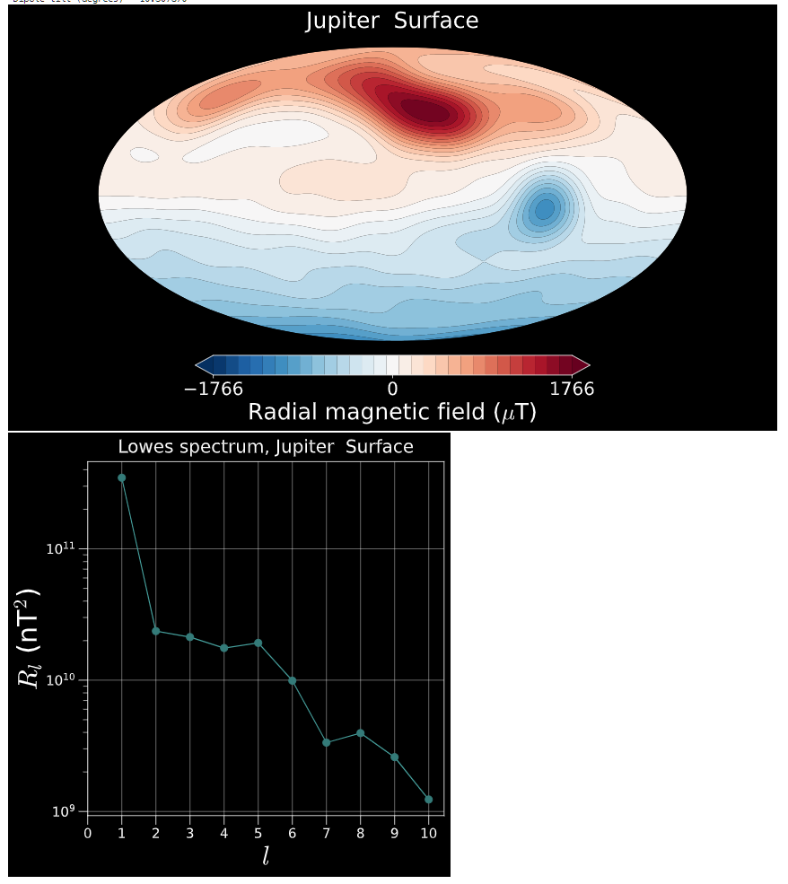

.. planetMagFields documentation master file, created by
   sphinx-quickstart on Mon Jan 22 08:32:05 2024.
   You can adapt this file completely to your liking, but it should at least
   contain the root `toctree` directive.
.. _secjup:

######################
Jupyter Notebook
######################

To make visualizations really easy, we include a `Jupyter <https://jupyter.org/>`_ notebook with the repository. To make it further easier, we include a `binder link <https://mybinder.org/v2/gh/AnkitBarik/planetMagFields/HEAD?labpath=%2FExploreFieldsInteractively.ipynb>`_ , so
the notebook can be run online, completely bypassing the need to install anything!

The notebook has a brief description at the top to enable users to install the correct prerequisites, followed by a section listing all the magnetic field models available, as shown below:

Thereafter, it provides two dropdown lists to select a planet and the available models and a slider for the radial level for which to generate the plots. This makes use of `Jupyter widgets <https://ipywidgets.readthedocs.io/>`_ .

The plots generated are the radial field and the Lowes spectrum at the selected radial level, where the planet's radius is normalized to one.

