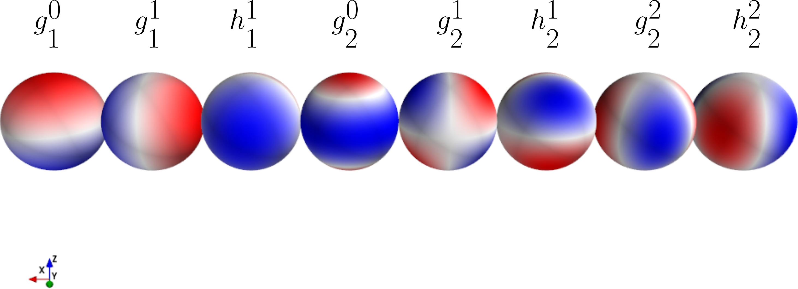

.. planetMagFields documentation master file, created by
   sphinx-quickstart on Mon Jan 22 08:32:05 2024.
   You can adapt this file completely to your liking, but it should at least
   contain the root `toctree` directive.

.. _secMath:

#########################
Mathematics
#########################

Magnetic fields in planets are generated by electric currents in a fluid region inside them through a process called dynamo action :cite:p:`Jones2011,Schubert2011,Stanley2014`. Outside this region, in the absence of current sources, the magnetic field :math:`\vec{B}` can be written as the gradient of a scalar potential :math:`V`. The potential :math:`V` is usually written as an expansion in orthogonal functions in spherical coordinates,

.. math::
   :label: eqgaussCoeff

   V = R_p \sum_{l,m} \left(\dfrac{R_p}{r}\right)^{l+1} [g_l^m \cos(m\phi) + h_l^m \sin(m\phi)] P_l^m (\cos\theta)\, ,

where, :math:`g_l^m` and :math:`h_l^m` are called the Gauss coefficients. Here, :math:`(r,\theta,\phi)` are spherical coordinates representing radial distance from the center of a planet, co-latitude and longitude, respectively. :math:`R_p` represents the radius of the planet and :math:`P_l^m` are associated Legendre functions of order :math:`l` and degree :math:`m`, where :math:`l` and :math:`m` are integers. The above equation can be recast in terms of spherical harmonics, which is what the code uses,

.. math::
   :label: eqgaussCoeffYlm

   V = R_p \sum_{l,m} \left(\dfrac{R_p}{r}\right)^{l+1} [g_l^m \mathrm{Re}(Y_l^m (\theta,\phi)) + h_l^m \mathrm{Im}(Y_l^m (\theta,\phi))]\, ,

where, :math:`\mathrm{Re}` and :math:`\mathrm{Im}` represent real and imaginary parts of the spherical harmonic :math:`Y_l^m (\theta,\phi)` of order :math:`l` and degree :math:`m`. The radial magnetic field is easily obtained using

.. math::
   :label: eqBr

   B_r(r,\theta,\phi) = -\dfrac{\partial V}{\partial r} = \sum_{l,m} (l+1) \left(\dfrac{R_p}{r}\right)^{l+2} [g_l^m \cos(m\phi) + h_l^m \sin(m\phi)] P_l^m (\cos\theta)\, .

This is the most commonly visualized component of the magnetic field of a planet, since the angular representation of the potential is unaffected and thus, it readily provides a representation of the field geometry (e.g: dipole vs quadrupole). Equation :eq:`eqgaussCoeffYlm` provides a way to extrapolate the field to any desired altitude with respect to the planetary surface, both above and below, as long as the region is outside the field generating region. For the radial part, this is done through equation :eq:`eqBr`. However, to obtain all three components, we have to extrapolate the potential to a desired height (or depth) with :eq:`eqgaussCoeff` and perform a spherical harmonic transform. We use the SHTns library :cite:`shtns` for this purpose.

.. \begin{figure}
.. \centering
..   \includegraphics[width=\textwidth]{figures/gauss_illustration.pdf}
..   \caption{Illustration of the potential/radial field patterns of the first eight Gauss coefficients.}
..   :label:fig:gauss}
.. \end{figure}

The Gauss coefficients represent the multipole modes of a planet's magnetic field, as illustrated in figure \ref{fig:gauss}. For example, :math:`g_1^0` represents the axial dipole (along the rotation axis) while :math:`g_1^1` and :math:`h_1^1` represent orthogonal components of the equatorial dipole. Thus, the dipole tilt of a planet, or the angle between the dipole and the rotation axis is given by:

.. math::
   :label: eqThetaDip

   \theta_{dip} = \tan^{-1}\dfrac{\sqrt{\left(g_1^1\right)^2 + \left(h_1^1\right)^2}}{g_1^0}

while the longitude of the dipole is given by:

.. math::
   :label: eqPhiDip

   \phi_{dip} = \tan^{-1}h_1^1/g_1^1

The raw data obtained from satellites or space missions are usually inverted to obtain these Gauss coefficients. These coefficients are the key to describing the surface magnetic field of a planet as well as how that magnetic field looks like at a certain altitude from the surface. The magnetic energy content on the surface in a certain degree :math:`l` is given by the Lowes spectrum:

.. math::

   R_{l} = (l + 1) \sum_{m}\left( \left(g_l^m\right)^2 + \left(h_l^m\right)^2\right),

:math:`l` plays the role of a wavenumber. Low degrees represent large spatial features in the field while high degrees represent small scale features. The maximum available degree :math:`l_{max}` of data for a particular planet depends on the quality of observations. For example, for Earth :math:`l_{max} = 13` because beyond that the magnetic field of magnetized rocks on the crust obscures any signal coming from the self generated field. Similarly, Jupiter's field was known only well constrained till :math:`l_{max} = 4` :cite:`Connerney1998` before the Juno mission provided excellent observations of finer scale structure to extend the well constrained :math:`l_{max}` to 18 :cite:`Connerney2022`.

References
^^^^^^^^^^

.. bibliography:: bib.bib

.. Indices and tables
.. ==================

.. * :ref:`genindex`
.. * :ref:`modindex`
.. * :ref:`search`
