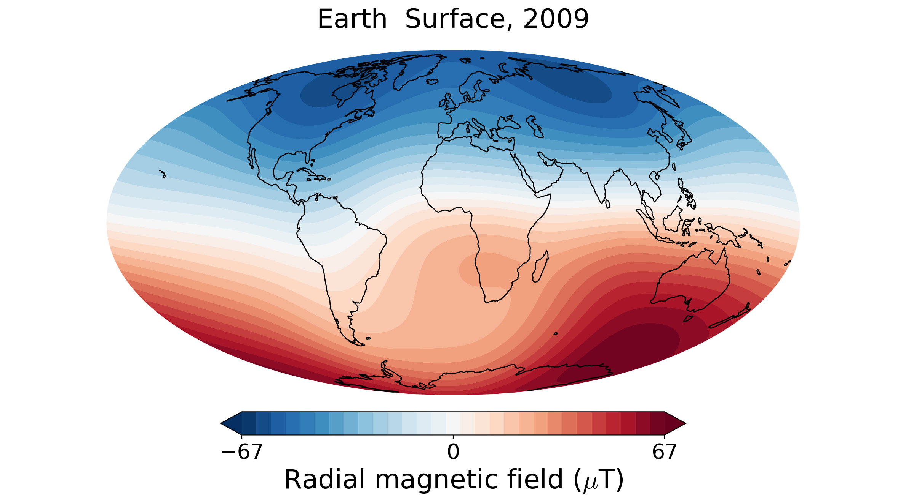

.. planetMagFields documentation master file, created by
   sphinx-quickstart on Mon Jan 22 08:32:05 2024.
   You can adapt this file completely to your liking, but it should at least
   contain the root `toctree` directive.
.. _secmodels:

################################
Magnetic field models and units
################################

We have support for different field models for planets. They are listed below:

 * *Mercury* :

   * `Anderson et al. 2012 <https://doi.org/10.1029/2012JE004159>`_
   * `Thébault et al. 2018 <https://doi.org/10.1016/j.pepi.2017.07.001>`_
   * `Wardinski et al. 2019 <https://doi.org/10.1029/2018JE005835>`_

 * *Earth* : `IGRF 14 <https://doi.org/10.5281/zenodo.14012303>`_, `Alken et al. 2021 <https://doi.org/10.1186/s40623-020-01288-x>`_

 * *Jupiter* :

   * `VIP4, Connerney et al. 1998 <https://doi.org/10.1029/97JA03726>`_
   * `JRM09, Connerney et al. 2018 <https://doi.org/10.1002/2018GL077312>`_
   * `JRM33, Connerney et al. <https://doi.org/10.1029/2021JE007055>`_

 * *Saturn* :

   * `Cassini SOI, Burton et al. 2009 <https://doi.org/10.1016/j.pss.2009.04.008>`_
   * `Cassini 11, Dougherty et al. 2018 <https://doi.org/10.1126/science.aat5434>`_
   * `Cassini 11+, Cao et al. 2020 <https://doi.org/10.1016/j.icarus.2019.113541>`_

 * *Uranus*  :

   * `Connerny et al. 1987 <https://doi.org/10.1029/JA092iA13p15329>`_
   * `Holme and Bloxham 1996 <https://doi.org/10.1029/95JE03437>`_
   * `Herbert 2009 <https://doi.org/10.1029/2009JA014394>`_

 * *Neptune* :

   * `Connerny et al. 1991 <https://doi.org/10.1029/91JA01165>`_
   * `Holme and Bloxham 1996 <https://doi.org/10.1029/95JE03437>`_

 * *Ganymede*: `Kivelson et al. 2002 <https://doi.org/10.1006/icar.2002.6834>`_

A list of models and keywords for them can be obtained using the :py:func:`get_models <planetmagfields.get_models>` function. For example:

.. code-block:: python

   In [1]: from planetmagfields import get_models

   In [2]: get_models("jupiter")
   Out[2]: array(['jrm09', 'jrm33', 'vip4'], dtype='<U5')

In case of Earth, a special argument ``year`` is also used to provide a year between 1900 to present day. This uses the IGRF14 model to compute a linear secular variation and extrapolate to the desired year. For example, the code below

.. code-block:: python

   In [1]: from planetmagfields import Planet

   In [2]: p = Planet(name='earth',year=2009)
   Planet: Earth
   Model: igrf14
   l_max = 13
   Dipole tilt (degrees) = -10.500800
   Year = 2009

   In [3]: p.plot(r=1)

produces the surface magnetic field in the year 2009.

.. _secUnits:

Units
******

In *physical space*, i.e., while plotting or extrapolating and obtaining the three components of the field :math:`B_r,B_\theta,B_\phi`, the default units are microTeslas. This can be changed while calling the :py:class:`planetmagfields.Planet` class:

.. code-block:: python

   In [1]: from planetmagfields import Planet

   In [2]: p = Planet(name='earth',year=2009,units='Gauss') #Will produce Br plots in Gauss

For *spectral space*, such as Gauss coefficients :math:`g_l^m` and :math:`h_l^m` (see section :ref:`Mathematics <secmath>`) and Lowes spectrum (section :ref:`Planet.spec()<secSpec>`) are always in nanoTeslas (nT).

.. Indices and tables
.. ==================

.. * :ref:`genindex`
.. * :ref:`modindex`
.. * :ref:`search`
