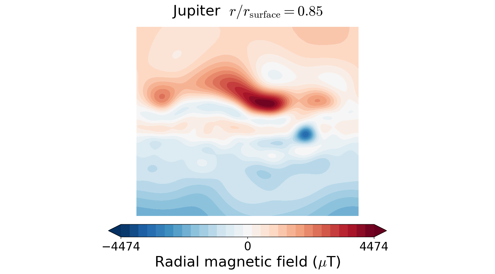
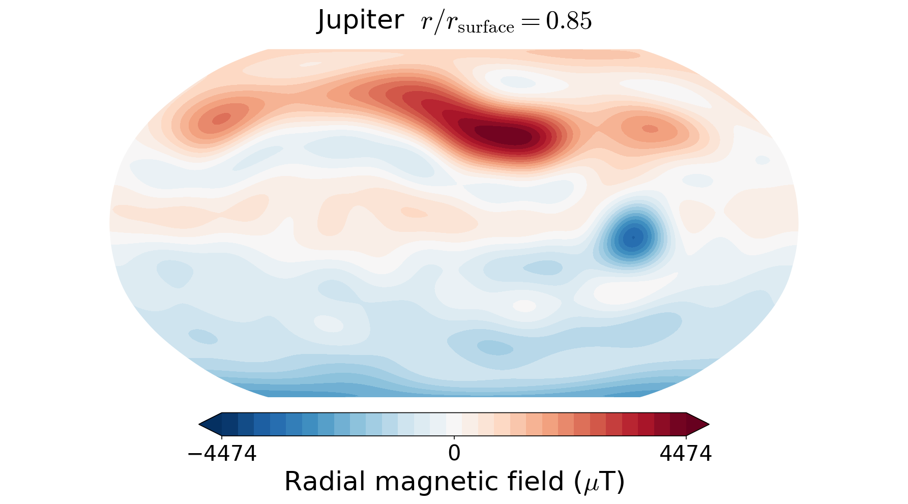
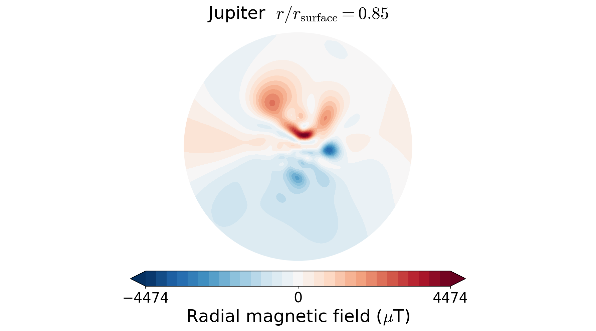
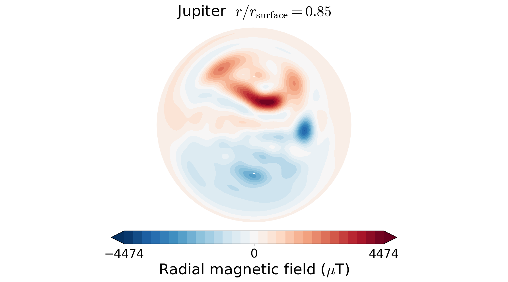

.. planetMagFields documentation master file, created by
   sphinx-quickstart on Mon Jan 22 08:32:05 2024.
   You can adapt this file completely to your liking, but it should at least
   contain the root `toctree` directive.
.. _secproj:

######################
Map projections
######################

By default, the plot function tries to use the Mollweide projection. However, using the power of the [cartopy](https://scitools.org.uk/cartopy/docs/latest/) library, any projection from [this list](https://scitools.org.uk/cartopy/docs/v0.15/crs/projections.html) is supported. In the absence of the cartopy library, the 2D plots fall back to the internally written Hammer projection. Examples of Jupiter's radial magnetic field at r=0.85 with different projections are shown below:

.. code-block:: python

  In [1]: from planetmagfields import *

  In [2]: p = Planet(name='jupiter',model='jrm09')
  Planet: Jupiter
  l_max = 10
  Dipole tilt (degrees) = 10.307870

  In [3]: p.plot(r=0.85)

  In [4]: projlist=['Mercator','Robinson','Stereographic','AzimuthalEquidistant']

  In [5]: for k,proj in enumerate(projlist):
    ...:     p.plot(r=0.85,proj=proj)
    ...:     savefig('jup_r0_85'+proj+'.png',dpi=150,bbox_inches='tight')
    ...:     close()

``In[3]`` produces the plot of Jupiter's field already shown above. ``In[5]`` produces the following figures with the Mercator, Robinson, Stereographic and azimuthal equidistant projections, respectively.

This also works with the :ref:`magField.py <secmagfieldscript>` script for quick plotting. Examples:

.. code-block:: bash

  ./magField.py -p earth -r 0.9 -m Robinson

or even with plots of all planets together

.. code-block:: bash

  ./magField.py -p all -r 0.9 -m Robinson

Note that the projection information is kept out of the plot titles to prevent too much text.

❗ | The Orthographic projection often does not create correct plots, be cautious while using it.
